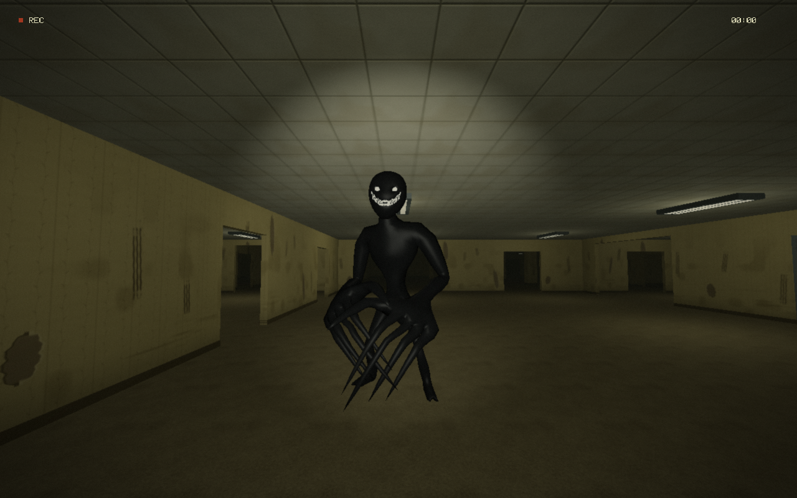

# BACKROOMS / Threshold v0.12 — Smiler update

An effectively endless, connected yellow interior in **C++17 and OpenGL 3.3 core** for the Computer Graphics Fundamentals project. Explore worn rooms, repeating corridors and open halls with smooth first-person controls, stamina, interactive doors and spatial sound. One tall, dark creature wanders the level, hears movement and chases when it detects you. Break contact, hide and follow optional clues toward an exit.



## Play on this Windows computer

1. If you cloned or downloaded the source from GitHub, follow [Build from source](#build-from-source) below first. Then open **Backrooms.exe** in the built project folder.
2. Click **Enter the Backrooms**, or select it with **Up/Down** and press **Enter**.
3. Use **WASD** and the mouse. Press **Escape** to pause and release the cursor.

The GitHub repository contains source code and assets; the build produces `Backrooms.exe`. The local Desktop copy already contains this executable. Keep the four `.glsl` files and the complete `assets/` directory beside it. No batch launcher is required. Project code generates environment textures, normal maps and ambient sound; footsteps use the bundled recordings credited in [THIRD_PARTY.md](THIRD_PARTY.md). The user's supplied **“Numbers” by Temporex** plays as background music. The game requires no photo assets or runtime downloads. If it cannot start, read `backrooms.log` and confirm that the graphics driver supports OpenGL 3.3.

## Controls

| Control | Action |
| --- | --- |
| Up/Down + Enter, or mouse click | Select and activate main/pause menu items |
| Enter, with the play/resume option selected | Begin / resume; continue exploring after reaching the exit |
| Enter or click Restart Run, after being caught | Restart the same seeded building with fresh stamina, doors and creature state |
| WASD + mouse | Move and look |
| Left Shift | Sprint while stamina is available |
| Hold Ctrl | Crouch; lower the camera and walk quietly |
| E | Open/close a nearby door; walk through the opened exit to escape |
| F | Toggle flashlight |
| C | Toggle flashlight-revealed clues |
| Tab | Toggle local map |
| H | Show controls |
| V | Toggle minimal camera HUD |
| M | Mute / unmute all sounds |
| O, in the main/pause menu | Open settings |
| Left/Right, in settings | Adjust the selected setting; mouse minus/plus controls also work |
| F1 | Show performance and world diagnostics |
| F2 | Show wireframe geometry |
| F3 | Enable/disable changes to distant unseen rooms |
| R | Return to the first room, keeping the seed |
| N, while paused | Start a different seeded building |
| F12 | Save a BMP screenshot to `captures/` |
| Escape | Pause / resume and release / capture mouse |
| Q, while paused | Quit |

Walking reaches **2.5 m/s**, Shift reaches **4.0 m/s**, and crouching reaches **1.1 m/s**. Acceleration and braking give movement weight. Holding Ctrl eases the eye height from 1.65 to 1.08 metres. Footsteps follow actual travel: crouching stays quiet, and wall pushing does not keep playing walking sounds. **M** mutes the complete sound mix.

Stamina starts at **100**, drains at **18 points per second** during actual sprint travel, and recovers at **14 points per second** after **1.5 seconds** without sprinting. Exhaustion prevents sprinting until stamina recovers to **22**. Pausing freezes stamina. Doors swing smoothly through **90° in about 0.8 seconds**. Their collision follows the moving panel; an obstructed closing door reverses instead of trapping the player. Pausing also freezes door movement. Reserved connecting routes remain traversable.

Mouse look is smoothly eased, and restrained head bob follows actual movement. The default camera has light soft focus and a field-of-view change from **78° to 82°** during sprint travel. Version 0.10 reduces the blur radius from 1.7 to **0.8 reference pixels** at the image centre, roughly halving the previous softness while keeping existing settings. The interface remains sharp. Rooms have dim fluorescent lighting and deep shadows; use **F** to toggle the flashlight. V hides the ordinary navigation HUD for a cleaner camera view; it does not record video.

The clickable main and pause menus provide play/resume, settings, a new seed, a return to the entrance and quit. Settings include **mouse sensitivity, master volume, music on/off, music volume, brightness, field of view, head bob, camera softness and VSync**, plus a reset-defaults option. Music volume defaults to **35%**, multiplied by master volume. Changes are saved to `settings.cfg` beside the executable. Head bob and camera softness can be set to zero. Press Escape in settings to return to the menu.

The yellow wallpaper and acoustic-ceiling style continues through classic rooms, repeating corridors, open halls, pillar halls, dead ends and occasional odd rooms with hard tiled floors. Layouts vary across **7.5, 15 and 22.5 metre** footprints under a uniform 3.2 metre ceiling. Procedural wall scars, peeling patches and damp marks combine with normal-mapped wallpaper, dry/damp carpet, ceiling tiles and hard flooring. The connected world continues generating as you walk. The older photo Nextbots, furniture and separate themed districts remain removed.

The **Smiler** uses the actual 3D mesh from the user-supplied `smiler-backrooms.zip`, whose model file is `source/Zombie Scream.fbx`. Its dark humanoid body, pale eyes and teeth are retained from the supplied mesh. Walk and run cycles are added through its skeleton; an imported scream animation supplies the capture pose. The offline conversion produces `assets/models/smiler/smiler.brm` for the game, so Blender is not needed to build or play. Source and conversion details are recorded in the [model notes](assets/models/smiler/README.md). This replaces the procedural Watcher introduced in v0.11. After an initial **8-second grace period**, one creature can enter unseen, reachable space **16–22 metres** from the player, closer than the previous 25–34 metre range. Walls and closed doors block its sight; obstructions reduce its hearing range. Crouching is quiet, sprinting is louder, and nearby door interactions can reveal your position.

The creature runs faster than walking speed but slower than the player's sprint. When contact is lost it searches the last sensed position, giving up after about **5 seconds** without seeing or hearing you. It navigates around walls and pillars, automatically stoops through low doorways and cannot catch through a closed door. Positional footfalls help you hear its direction during a chase. Contact triggers a roughly **1-second 3D jumpscare**, then a game-over screen. Click **Restart Run** or press **Enter** with that option selected to restart the same seed. Restart restores stamina and resets the creature and doors; settings remain saved. **Main Menu** prepares a fresh run with the same seed and leaves it paused at the menu. Escape cannot resume a defeated run. Music pauses during capture and the game-over screen. **M** and master volume also apply to the jumpscare sound.

Ceiling fixtures have seeded **working, dying or off** states. Working lamps fluctuate gently, dying fixtures flicker more strongly, and off fixtures contribute no light. Each selected local light uses distance attenuation. The flashlight provides a separate directional beam.

Sound uses the existing Windows **WinMM** output API, with no additional library. The stereo mixer pans world-space sources relative to the camera and attenuates them using their three-dimensional distance. The nearest active fluorescent fixture hums; seeded distant creaks and drips add ambience. The six recorded footsteps are cached and filtered differently for carpet, damp carpet and hard floors. A subdued drone and occasional electrical stinger respond to environmental tension. The creature adds positional heavy steps and a recognition cue; capture uses a brief centered sting with controlled headroom. Ambient, door and threat sounds are generated placeholders cached before gameplay; the original footstep recordings and credits remain unchanged.

The soundtrack plays from `assets/audio/music/numbers-temporex.mp3`, converted locally from the supplied file for compatibility with this computer's Windows decoder. The original `numbers-temporex.m4a` is preserved in the same directory. Windows WinMM/MCI plays the music separately from positional environmental sounds, without another runtime library. Pause, **M**, or switching music off pauses the track; resuming keeps its playback position. Music volume can be lowered independently of footsteps and ambience. The generated audio-preview WAV contains the environmental mix, not the song.

The green **EXIT SIGNAL** shows distance and direction relative to your view. The exit is fitted into a wall opening at `(6.225, -267)`, with its approach near `(6.225, -265.8)`, about 270 metres north of the entrance. Follow the clear north route, approach the green sign, face the door and press **E**. Wait for it to open, then **walk through the doorway** to escape. Pressing E alone does not end the game. The **YOU ESCAPED** screen pauses play; **Enter** continues exploration. The local map shows the exit when it is in range.

To see the first clue, stand in the starting room, face its first north doorway, and aim the flashlight at the doorway's left side. Toggle F to compare.

## Features in version 0.12

- Seeded, connected yellow rooms, corridors, halls, pillars, dead ends and occasional tiled rooms.
- Smooth mouse look, gradual acceleration/braking, adjustable head bob, crouching, stamina and collision sliding.
- Animated hinged doors, a farther wall-integrated exit about 270 m from the entrance, and flashlight-revealed clues.
- The supplied 3D Smiler with walk/run animation, closer 16–22 m spawns, sight/hearing detection, collision-aware pursuit, last-position searching and a timed loss of interest.
- A 3D capture jumpscare, generated threat audio, game-over screen and same-seed restart.
- Procedural worn materials with UV mapping, mipmaps and normal maps.
- Working/dying/off fluorescent fixtures, per-light attenuation, a flashlight cone, Blinn-Phong shading and distance fog.
- An offscreen scene framebuffer with light soft focus, analog grain and vignette, followed by a sharp HUD.
- Stereo spatial hum, distant ambience, environmental tension, door sounds, surface-dependent recorded footsteps and the supplied Temporex soundtrack.
- Main/pause menus and persistent camera, audio and display settings.
- Bounded room streaming, origin rebasing for distant travel, local map and rendering diagnostics.

Room loading keeps **25 playable chunks** and at most **24 prepared neighbours**. Each chunk has 6 × 6 cells, each 7.5 metres wide, for a **45 × 45 metre** chunk. One nearby chunk is prepared per frame and its mesh can upload before it becomes active. Unchanged nearby chunks can be reused on a turn back. GPU synchronization limits queued rendering work. Audio uses cached clips and at most 12 overlapping one-shot voices.

Initial loading, teleports and cache misses can still generate geometry synchronously. Read the measured results and their limits in [verification.md](docs/verification.md). The base world regenerates from its seed. Temporary room changes reset after their chunk unloads; at most 128 opened-door overrides are remembered, after which the oldest return to their seeded state when regenerated. “Endless” means continuing generation within finite numeric limits and bounded memory.

## Build from source

The working setup on this computer is **MSYS2 MinGW64 GCC + GLFW**. The build script locates it at `C:\msys64\mingw64`, or uses `BACKROOMS_CXX` / a suitable compiler on PATH.

Close the game before rebuilding. From the project folder, run:

```powershell
powershell -NoProfile -ExecutionPolicy Bypass -File .\build.ps1 -Test
```

On a fresh Windows machine, install MSYS2 and these packages from its **MinGW64 terminal**:

```sh
pacman -S --needed mingw-w64-x86_64-gcc mingw-w64-x86_64-glfw
```

GLAD support files are included in `common/` and `include/`. The build script statically links GLFW and the MinGW runtime. Windows system libraries and a compatible graphics driver remain required. Its PATH change applies only to its own process.

Alternative course-style build definitions are supplied:

```sh
make
make test
```

```sh
cmake -S . -B build
cmake --build build --config Release
ctest --test-dir build --output-on-failure
```

The primary verified build is the Windows PowerShell route. Other toolchains require testing on their target machines. CMake copies the runtime shaders and assets beside its executable, including the converted creature mesh and audio.

## Source organization

The structure follows the familiar BR_A1 arrangement of root source/shader files, `common/` and `include/`.

```text
Backrooms CGF Project/
  backrooms.cpp              Application, input, camera, rendering and HUD
  world.cpp / world.h        Generation, streaming and collision
  vshader_backrooms.glsl     Model / view / projection vertex stage
  fshader_backrooms.glsl     Textures, local lighting, flashlight and fog
  vshader_lens.glsl          Fullscreen postprocess vertex stage
  fshader_lens.glsl          Soft focus, grain and vignette
  common/gameplay.h         Movement speed and field-of-view settings
  common/movement.h         Acceleration and braking
  common/player_state.h     Stamina and smooth mouse-look state
  common/threat.h / .cpp    Single-creature sensing, navigation and behavior
  common/threat_model.h/.cpp Converted Smiler mesh, walk/run clips and capture pose
  common/settings.h         Validated persistent user settings
  common/audio.h / .cpp     Recorded steps, cached spatial mixer and Windows playback
  common/music.h / .cpp     Supplied soundtrack playback through Windows MCI
  common/                   Math, shader loading, textures, UI and GLAD
  include/                  Generated GLAD and Khronos headers
  tests/                    CPU tests and graphics verification evidence
  assets/audio/footsteps/    Bundled recorded footstep WAV files
  assets/audio/music/        User-supplied Numbers by Temporex
  assets/models/             Supplied FBX source and converted creature animation cache
  assets/                   In-game preview and exported audio preview
  docs/                     Report draft, slides, demo and learning guide
  build.ps1                 Windows build and test
  settings.cfg              User preferences, created when settings change
  Makefile / CMakeLists.txt  Alternative build definitions
```

## Verification and demonstration

Read [verification.md](docs/verification.md) for executed checks and their limits. Automated captures can run without taking over the desktop:

```powershell
.\Backrooms.exe --hidden --demo --frames 120 --capture assets\test.bmp
.\Backrooms.exe --seed 42 --hidden --demo --frames 120
.\Backrooms.exe --demo --x 6.225 --z -265.8 --yaw -90
.\Backrooms.exe --audio-preview assets\audio-preview.wav
```

The 12-second stereo sound preview demonstrates carpet walking, damp-carpet crouching, hard-floor sprinting, left/right ambience and environmental tension. It mixes the bundled footstep recordings with generated sounds and does not record a playthrough. Supporting materials:

- [Course requirements and status](docs/requirements.md)
- [Report draft](docs/report-draft.md)
- [Earlier presentation](docs/presentation.html), a historical v0.8 deck to update before demonstrating v0.12
- [3–6-minute demo script](docs/demo-script.md)
- [Learning guide](docs/learning-guide.md)
- [AI assistance disclosure](docs/AI_USE.md)
- [Third-party licenses](THIRD_PARTY.md)

## Scope and remaining work

This version combines exploration with one simple threat. It has no photo sprites, separate themed districts, furniture, weapons, network play or saved gameplay sessions. The creature uses bounded local pathfinding and a short memory, without complex tactics or a general-purpose navigation system. Settings persist, but world progress does not. Lighting can contribute across walls because it has no shadow maps or full global illumination. Audible spatial playback uses stereo panning and distance attenuation, without HRTF filtering or acoustic propagation; the creature's hearing uses a separate obstruction-based detection rule. Normal maps change shading, not geometry. The exit presents an ending screen. Initial loading and cache misses remain synchronous, and procedural architectural motifs repeat.

This educational prototype includes substantial Codex assistance. Review and adapt the implementation, record student contributions and be able to explain it. The supplied syllabus's restrictions and disclosure requirements still apply. Team details, the official report template, defence date and final instructor rubric remain to be confirmed before an assessed submission. Nothing has been submitted to Moodle.


